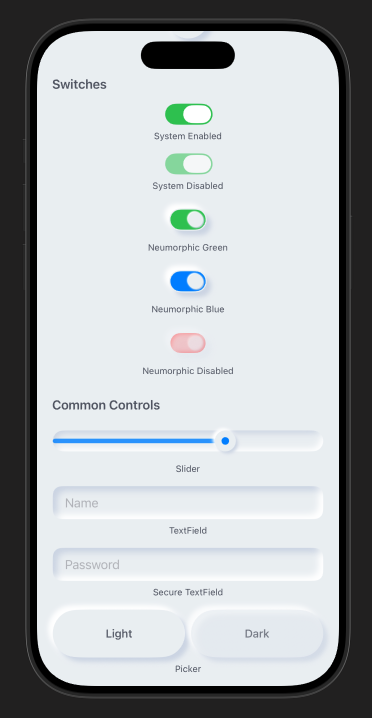
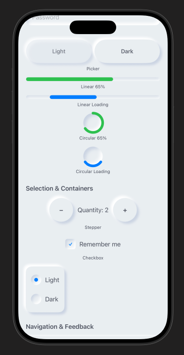
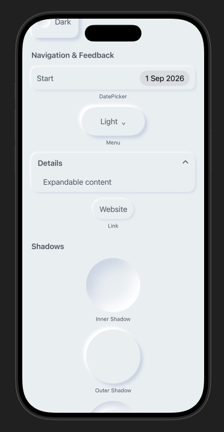
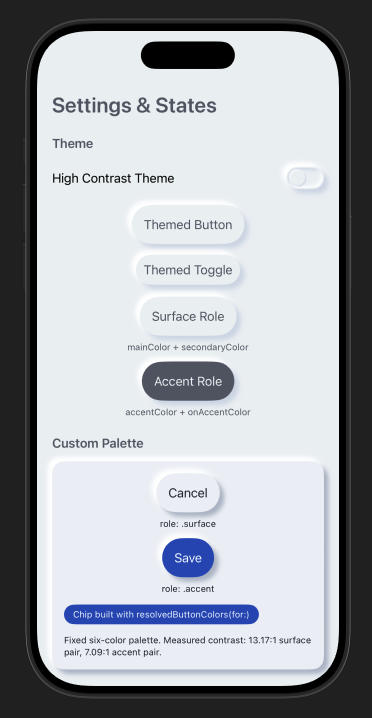
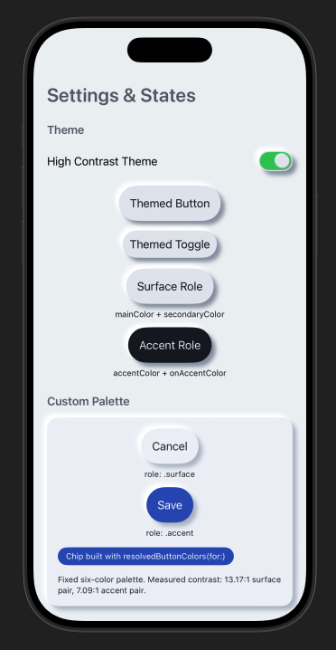

# Neumorphic SwiftUI : Neumorphism Soft UI

Neumorphic is a SwiftUI utility to build Neumorphism Soft UI easily using custom view modifier and custom button style. It supports all shapes. 

Hi, I’m Costa. It is simple to create outer shadow in SwiftUI by writing two lines of code. However, we can’t easily create inner shadow in SwiftUI. That’s the reason why I build this tool to make it simple and reusable.


## Additional controls

The following views and styles were added in the v2.x updates (see `ExampleShowcaseView.swift` for copy-ready usage):

- **Theme** — `NeumorphicTheme`, including **accent** / **onAccent** button roles and `resolvedButtonColors`
- **Buttons** — `FixedSizeSoftDynamicButtonStyle` for fixed-size soft buttons
- **Inputs** — `NeumorphicTextField`, `NeumorphicSlider`, `NeumorphicStepper`, `NeumorphicPicker`, `NeumorphicDatePicker`
- **Chrome** — `NeumorphicCard`, `NeumorphicLink`, `NeumorphicMenu`, `NeumorphicDisclosureGroup`
- **Progress** — `NeumorphicProgressView`, `NeumorphicCircularProgressView`
- **Selection** — `NeumorphicSelectionControls`
- **Interaction** — `NeumorphicFocusRing`, `NeumorphicHoverEffect`
- **Accessibility** — `NeumorphicAccessibility` helpers (contrast / accessibility labels for soft UI)

Open the example app, then the settings screen, to try accent palettes and the new controls.


## Installation
Requirements
.iOS(.v13),.macOS(.v10_15)

#### Swift Package Manager 
1. In Xcode, open your project and go to File → Swift Packages → Add Package Dependencies.
2. Paste the repository URL (https://github.com/costachung/neumorphic/) and click Next.
3. For Rules, select version.
4. Click Finish.

#### Swift Package
```swift
.package(url: "https://github.com/costachung/neumorphic/", .upToNextMajor(from: "2.4.1"))
```

## Usage
Import Neumorphic package to your view.

```swift
import Neumorphic
```

Simply use **.softOuterShadow** and **.softInnerShadow** methods to create outer shadow and inner shadow respectively.

#### Create Rounded Rectangle with Outer Shadow


```swift
RoundedRectangle(cornerRadius: 20).fill(Color.Neumorphic.main).softOuterShadow()
```

#### Create Rounded Rectangle with Inner Shadow


```swift
RoundedRectangle(cornerRadius: 20).fill(Color.Neumorphic.main).softInnerShadow(RoundedRectangle(cornerRadius: 20))
```

#### Create Circles


```swift
  HStack {
      Circle().fill(Color.Neumorphic.main).softOuterShadow()
      Circle().fill(Color.Neumorphic.main).softInnerShadow(Circle())
  }
```

### Customization

You can change the color, spread of the shadow, and the shadow radius of the shadow.

```swift
func softOuterShadow(
    darkShadow: Color = Color.Neumorphic.darkShadow,
    lightShadow: Color = Color.Neumorphic.lightShadow,
    offset: CGFloat = 6,
    radius: CGFloat = 3
) -> some View

func softInnerShadow<S: Shape>(
    _ content: S,
    darkShadow: Color = Color.Neumorphic.darkShadow,
    lightShadow: Color = Color.Neumorphic.lightShadow,
    spread: CGFloat = 0.5,
    radius: CGFloat = 10
) -> some View
```

Or reach for a preset instead of tuning by hand — `.standard`, `.subtle`, or `.none`:

```swift
RoundedRectangle(cornerRadius: 16)
    .fill(Color.Neumorphic.main)
    .softOuterShadow(.subtle)
```

An inset field, for instance, is just a text field over an inner-shadowed background:


Example of using background method to add it under TextField:

```swift
HStack {
    Image(systemName: "magnifyingglass")
        .foregroundColor(Color.Neumorphic.secondary)
        .font(Font.body.weight(.bold))
    TextField("Search ...", text: $name)
        .foregroundColor(Color.Neumorphic.secondary)
}
.padding()
.background(
    RoundedRectangle(cornerRadius: 30)
        .fill(Color.Neumorphic.main)
        .softInnerShadow(RoundedRectangle(cornerRadius: 30), spread: 0.05, radius: 2)
)
```


And a bar chart is an inner-shadowed track with a plain fill on top:


```swift
ZStack(alignment: .bottom) {
    RoundedRectangle(cornerRadius: 20)
        .fill(Color.Neumorphic.main)
        .softInnerShadow(RoundedRectangle(cornerRadius: 20), spread: 0.3, radius: 2)
        .frame(width: 30, height: 150)

    RoundedRectangle(cornerRadius: 20)
        .fill(barColor)
        .frame(width: 30, height: 100)
}
```
    
## Controls

Rather than rebuilding these on top of the shadow modifiers each time, the package ships them:

| Category | Controls |
|---|---|
| Input | `NeumorphicSlider`, `NeumorphicTextField`, `NeumorphicStepper`, `NeumorphicDatePicker` |
| Selection | `NeumorphicPicker`, `NeumorphicCheckbox`, `NeumorphicRadio`, `NeumorphicMenu` |
| Status | `NeumorphicProgressView`, `NeumorphicCircularProgressView` |
| Layout | `NeumorphicDisclosureGroup`, `.neumorphicCard()` |
| Navigation | `NeumorphicLink` |

```swift
VStack(spacing: 20) {
    NeumorphicSlider(value: $volume, in: 0...100, step: 1)
    NeumorphicTextField("Name", text: $name)
    NeumorphicProgressView(value: progress)
    NeumorphicPicker(selection: $mode, options: ["Light", "Dark"])
}
```

macOS gets two extras: `.neumorphicFocusRing(_:isFocused:)` for keyboard focus and `.neumorphicHover(_:isHovered:)` for pointer feedback.


## Buttons

#### Create Soft Button

```swift
Button(action: {}) {
    Text("Soft Button").fontWeight(.bold)
}
.neumorphicThemedButtonStyle(RoundedRectangle(cornerRadius: 20))
```

```swift
func neumorphicThemedButtonStyle<S: Shape>(
    _ shape: S,
    padding: CGFloat = 16,
    pressedEffect: SoftButtonPressedEffect = .hard
) -> some View

func neumorphicThemedButtonStyle<S: Shape>(
    _ shape: S,
    role: NeumorphicButtonRole,
    padding: CGFloat = 16,
    pressedEffect: SoftButtonPressedEffect = .hard
) -> some View
```


#### Create Soft Button with custom style

```swift
HStack {
    Button(action: {}) {
        Image(systemName: "heart.fill")
    }.neumorphicThemedButtonStyle(Circle(), role: .accent)

    Button(action: {}) {
        Image(systemName: "heart.fill")
    }.buttonStyle(
        SoftDynamicButtonStyle(
            Circle(),
            mainColor: .red,
            textColor: .white,
            darkShadowColor: Color(red: 0.6, green: 0.2, blue: 0.2),
            lightShadowColor: Color("redButtonLightShadow"),
            pressedEffect: .hard
        )
    )
}
```
For a fixed visual size that still keeps a 44-point hit area, use `.fixedSizeSoftButtonStyle(_:size:)`.


## Soft Button - Pressed Effects


```swift
HStack {
    Button(action: {}) { Text(".none").fontWeight(.bold) }
        .neumorphicThemedButtonStyle(Capsule(), pressedEffect: .none)
    Button(action: {}) { Text(".flat").fontWeight(.bold) }
        .neumorphicThemedButtonStyle(Capsule(), pressedEffect: .flat)
    Button(action: {}) { Text(".hard").fontWeight(.bold) }
        .neumorphicThemedButtonStyle(Capsule(), pressedEffect: .hard)
}
```
`.hard` presses the surface in, `.flat` removes the shadow, `.none` leaves it alone.


## Toggle 

## Switch


```swift
Toggle("Toggle", isOn: $toggleIsOn)
      .toggleStyle(.neumorphicSwitch)
```
Or `.neumorphicThemedSwitchStyle(tint:labelsHidden:height:)` to follow the environment theme, and `NeumorphicSwitchToggleStyle(tint:labelsHidden:)` when you want to configure it directly.


### Shape


A toggle that presses in and stays in — good for play/stop:

```swift
Toggle(isOn: $toggleIsOn) {
    Image(systemName: toggleIsOn ? "stop.fill" : "play.fill")
        .font(.title)
}
.neumorphicThemedToggleStyle(Circle(), padding: 20)
```

    
## Themes, light and dark

`Color.Neumorphic` adapts to light and dark mode on its own. For anything beyond that, put a theme in the environment — built-in controls read it, and the themed button and toggle modifiers follow it. Buttons use `.surface` by default; use `.accent` for the theme's accent/onAccent pair:

```swift
VStack {
    NeumorphicTextField("Name", text: $name)
    Button("Save") { }
        .neumorphicThemedButtonStyle(RoundedRectangle(cornerRadius: 12), role: .accent)
}
.neumorphicTheme(.highContrast)
```

`.standard` and `.highContrast` ship with the package; `NeumorphicTheme` is a plain struct, so your own palette is just another value. The four-color initializer remains available and maps accent/onAccent to secondary/main for source-compatible behavior; use the six-color initializer when those semantic pairs differ.

`NeumorphicKit.colorSchemeType` still exists for source compatibility with apps that override color resolution globally. New code should prefer `preferredColorScheme(_:)` and `.neumorphicTheme(_:)`.

## Accessibility

Neumorphism is a low-contrast style, which makes accessibility work load-bearing rather than optional. Across the full supported deployment range, the controls here provide VoiceOver labels, values, traits, and adjustable actions; keep at least 44-point interaction targets; signal selection with symbols and not color alone; and respect Reduce Motion in anything animated.

Two things worth doing on your side: pass `accessibilityLabel` to sliders and progress views so VoiceOver announces something more useful than "Slider", and test with VoiceOver, Larger Text, Increase Contrast, Reduce Motion, and a hardware keyboard on macOS.


## Example Project
Check out the __neumorphic-examples__ XCode project to see how to use neumorphic UI. 
Open `neumorphic-examples/neumorphic-examples.xcodeproj`. Demo screens live in `neumorphic-examples/Shared/` (`ExampleShowcaseView.swift`, `ExampleSettingsView.swift`).








## Contacts
https://twitter.com/costachung

# License
Neumorphic Package is released under the MIT license. See the LICENSE file for more info.
